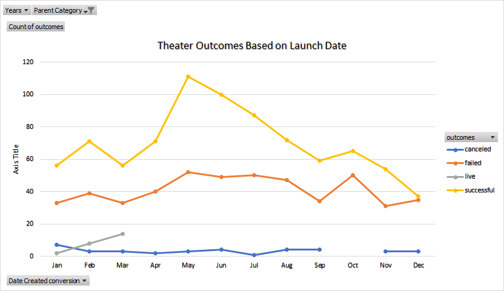

# Kickstarting with Excel
## Overview of Project
This project was an introduction to data analysis in Excel. It was a crash course in learning how to take a dataset and filter out useful information from within an Excel spreadsheet.
### Purpose
The purpose of the project is to give the student practice in filtering data down to manageable quantities to extract focused and coherent results when presented with large amounts of data.
## Analysis and Challenges
Starting with the data from https://github.com/pcurl1986/kickstarter-analysis/blob/main/data-1-1-3-StarterBook%20(version%201).xlsx
I first formatted the Excel sheet to define managable data catageories. Then, based on the Deliverable requirements, I generated the Pivot tables and charts needed to complete this assignment. By creating the Theater Outcomes by Launchdate chart, I was able to focus on the fundraising data for just one category . By filtering outcomes based on the financial goals of each project I was able to create a chart to illustrate the success rates of various funding goal ranges. 

The biggest challenge I encountered during this assignment would have to be my own raging self doubt. Constantly questioning if I did the assignment correctly or ended up with the correct data. Between friends and family helping me (and lots of Google searches) I was able to succeed in completing the assignment (I think). Further challenges that I faced are: inconsistent formatting of the dataset, learning how a github repository works, and learning how to use a markdown language(I still do not fully understand what it is). Despite these chalenges, I still got here in the end. Yay me!
## Results
### Analysis of Outcomes Based on Launch Date
Based on the information I extracted from dataset and that I used to create the chartbelow, we can see that fundraisers for the theater category are most successful between April and August with the highest peak in May. We can also see that starting a fundraiser in December is very risky as almost half of them ended in failure.

### Analysis of Outcomes Based on Goals
Based on the information I extracted from the dataset onto this chart, we can see that the ranges of $10,000-$14,999 and $40,000-$44,999 are the most likely goal ranges to be fully funded based on their success rates.

### Limitations of the Dataset
The dataset is limited by not containing 100% of the variables affecting success or failure of a given campaign. For example: whether they were professionaly represented by an agent, whether there was funding sought outside of Kickstarter, the quality of the write up for the Kickstarter campaign, etc.
The conclusions reached are valid based on the data presented, although we do not know what effect the missing variables had on any given campaigns success rate. Some of the data has no clear use. For example the blurb column: There is no practical way to filter that data type or compare it to any other metric.
### Other Possible Tables or Graphs
Using the same data we can create outcomes based on media categories, wether being a staff pick improved the chance of success, and what the optimal campaign length would be.

